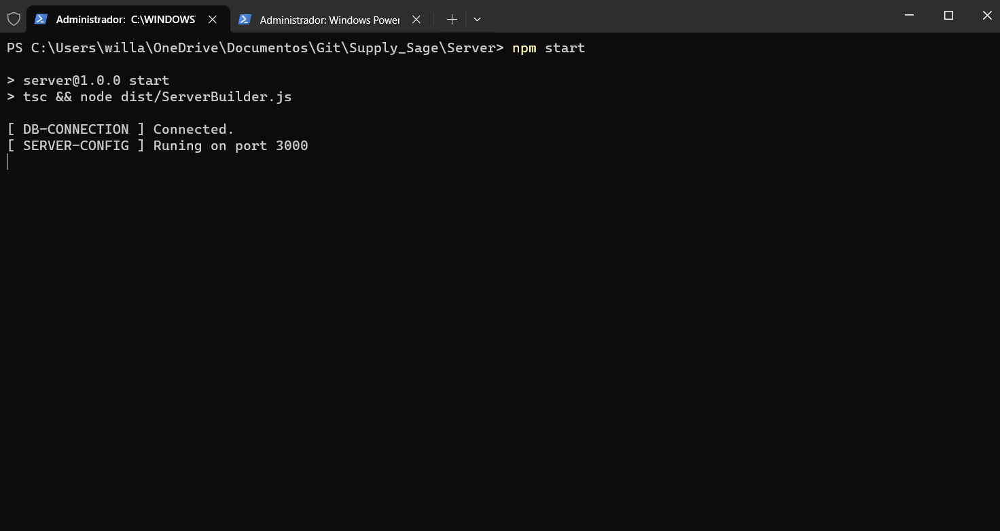
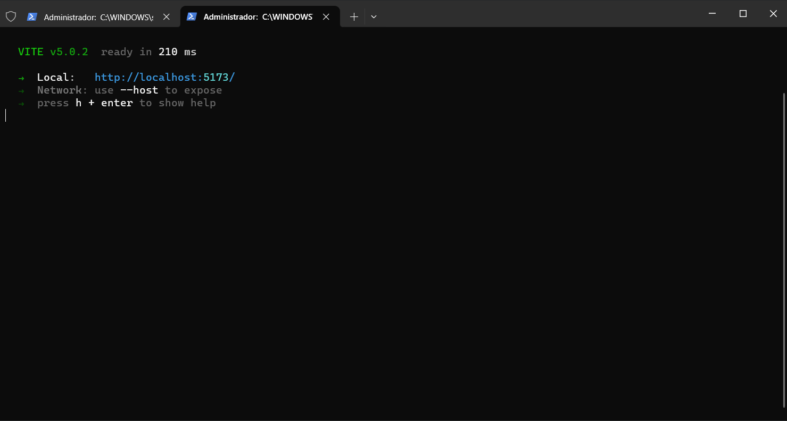
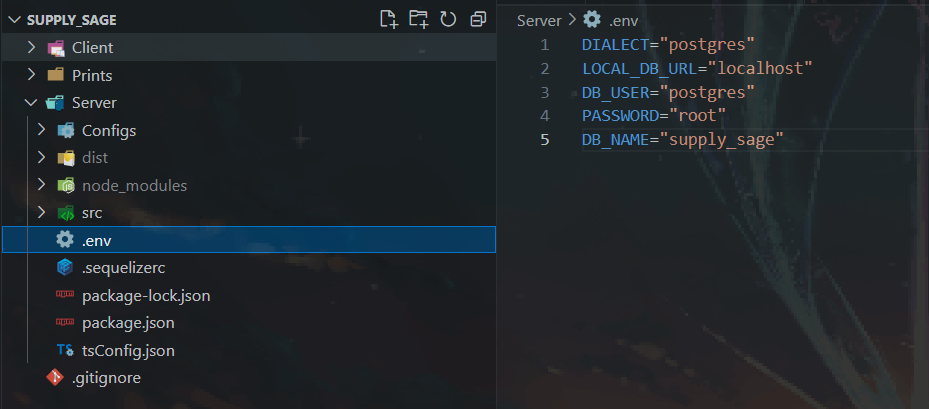
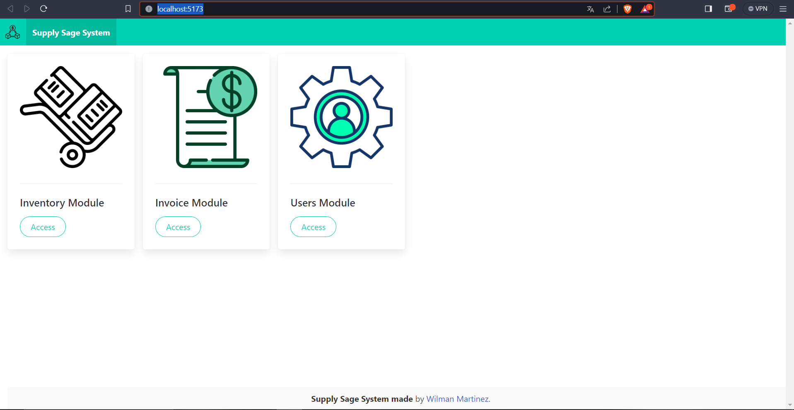
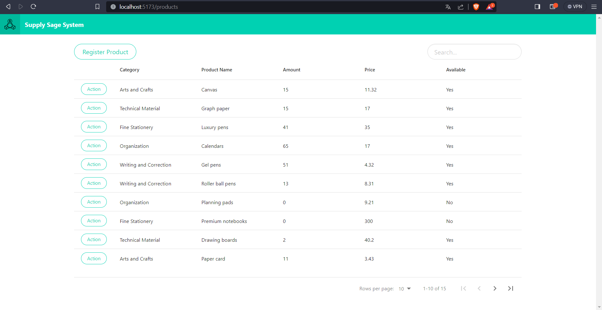
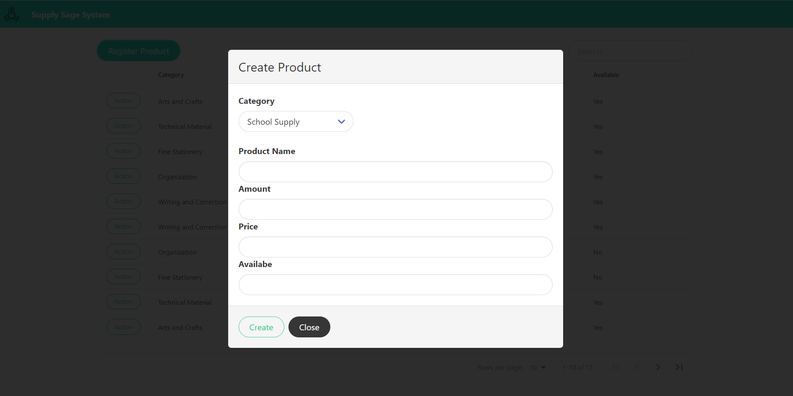
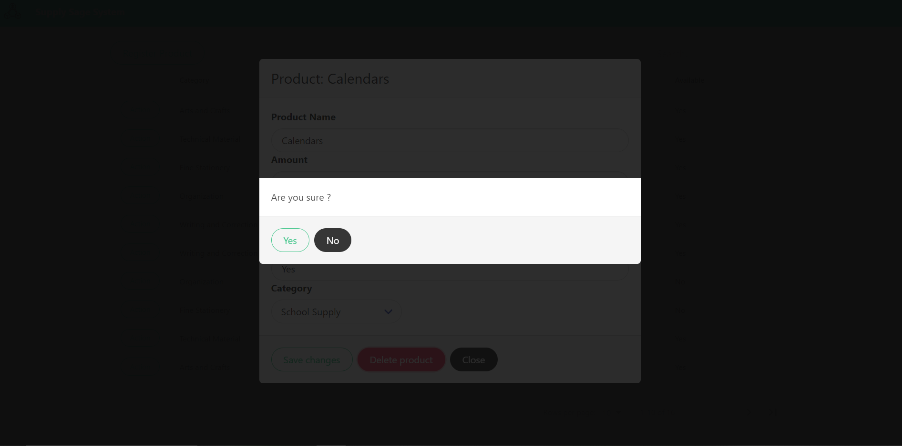
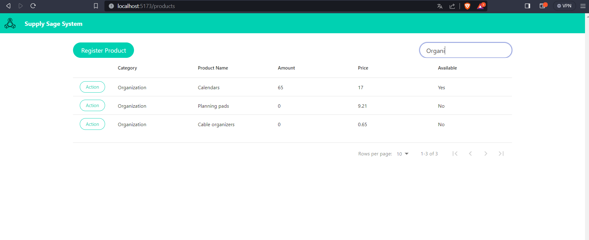
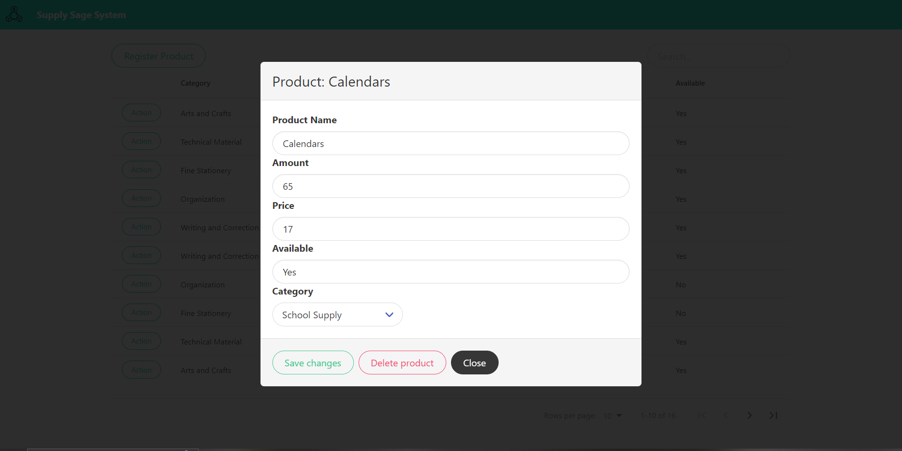

# Supply_Sage

## Descrição
Aplicação web usada para controle de estoque de uma papelaria. Para esse projeto, foi feito o uso de programação orientada a objetos no back-end e de padrões de projetos para a criação dos produtos.

## Como iniciar o projeto
- Use dois terminais da forma que achar melhor. Navegue até o diretório Server dentro do projeto e rode o comando "npm start" para iniciar o servidor, depois no outro terminal,
  acesse o diretório Client e rode o comando "npm run dev". Prints abaixo exemplificando as instruções:

  - Server
  

  - Client
  

## Tecnologias utilizadas

- Aplicação construída usando requisições somente http por conta de praticidade.
- Utilizado no back-end Nodejs e Typescript na versão 20.9.0 e como base de dados o PostgreSQL na versão 16
  - Links para instalação de ambos ( https://nodejs.org/en/download, https://www.postgresql.org/download/ )
- Utilizado no front-end React e Vite em sua versão 5.0

## Requisitos para o funcionamento do projeto
- Ter o Nodejs em sua versão 18+, junto com o npm.
- Ter instalado o PostgreSQL como serviço para uso local.
- Configurar um arquivo .env conforme mostra o print abaixo, ou modificar a classe que retorna a configuração de conexão com o banco.

  - arquivo .env de exemplo:
  

## Funcionamento da aplicação
- Criado no React rotas de Home e Products, conforme mostra nos prints abaixo.
- Rota home: Usuário tem acesso aos módulos do sistemas para escolher qual acessar (apenas o de estoque foi implementado, o restante é para exemplificar como seria a interface da aplicação)
- Rota products: Usuário tem acesso a uma tabela contendo todos os produtos cadastrados. Através dela é possível filtrar por texto, ordenar os dados de forma crescente ou decrescente,
  controlar número de cadastros por página, cadastrar novos produtos, atualizar produtos e deletar produtos.
  
  - Página Home
  

  - Página Products:
  

  - Exemplo de cadastro de um produto:
  

  - Exemplo de remoção de um produto:
  

  - Exemplo de filtro:
  

  Exemplo de dados mostrados por modal ao clicar em action de cada linha: 
  

### Documentação das API's

- Foram definidos API's com respostas padronizadas como mostram abaixo.

## API's de Products

### POST /api/products/createProducts

Cria novos produtos.

**Parâmetros**

| Nome      | Tipo     | Descrição                    |
|-----------|----------|------------------------------|
| products  | Object   | Objeto com os dados do produto para serem criados. |

**Resposta**

| Código | Descrição                    |
|--------|------------------------------|
| 201    | Product created.|
| 400    | Failed trying to create a new product.|
| 500    | Internal server error.|

**Exemplo de resposta**

```json

{
    "type": "Success",
    "message": "Product created.",
    "statusCode": 201,
    "objectResult": {
        "id": 13,
        "category": "Office Supply",
        "productName": "Papers",
        "amount": 19,
        "price": 0.22,
        "available": true
    }
}

```

### GET /api/products/getProducts

Retorna todos os produtos.

**Parâmetros**

| Nome    | Tipo     | Descrição                    |
|---------|----------|------------------------------|
| nenhum  | nenhum   | API retorna todos os produtos cadastrados. |

**Resposta**

| Código | Descrição                    |
|--------|------------------------------|
| 200    | Products founded.|
| 404    | Products not founded.|
| 500    | Internal server error.|

**Exemplo de resposta**

```json

{
    "type": "Success",
    "message": "Products founded.",
    "statusCode": 200,
    "objectResult": [
        {
            "id": 15,
            "category": "Office Supply",
            "productName": "Notebooks",
            "amount": 52,
            "price": 600,
            "available": true
        },
        {
            "id": 16,
            "category": "Arts and Crafts",
            "productName": "Canvas",
            "amount": 15,
            "price": 11.32,
            "available": true
        },
        {
            "id": 17,
            "category": "Technical Material",
            "productName": "Graph paper",
            "amount": 15,
            "price": 17,
            "available": true
        },
        {
            "id": 18,
            "category": "Fine Stationery",
            "productName": "Luxury pens",
            "amount": 41,
            "price": 35,
            "available": true
        },
        {
            "id": 19,
            "category": "Organization",
            "productName": "Calendars",
            "amount": 65,
            "price": 17,
            "available": true
        },
        {
            "id": 20,
            "category": "Writing and Correction",
            "productName": "Gel pens",
            "amount": 51,
            "price": 4.32,
            "available": true
        },
        {
            "id": 21,
            "category": "Writing and Correction",
            "productName": "Roller ball pens",
            "amount": 13,
            "price": 8.31,
            "available": true
        },
        {
            "id": 22,
            "category": "Organization",
            "productName": "Planning pads",
            "amount": 0,
            "price": 9.21,
            "available": false
        },
        {
            "id": 23,
            "category": "Fine Stationery",
            "productName": "Premium notebooks",
            "amount": 0,
            "price": 300,
            "available": false
        },
        {
            "id": 24,
            "category": "Technical Material",
            "productName": "Drawing boards",
            "amount": 2,
            "price": 40.2,
            "available": true
        },
        {
            "id": 25,
            "category": "Arts and Crafts",
            "productName": "Paper card",
            "amount": 11,
            "price": 3.43,
            "available": true
        },
        {
            "id": 26,
            "category": "School Supply",
            "productName": "Calculators",
            "amount": 35,
            "price": 6.21,
            "available": true
        },
        {
            "id": 27,
            "category": "School Supply",
            "productName": "Colored pencil",
            "amount": 100,
            "price": 0.32,
            "available": true
        },
        {
            "id": 28,
            "category": "Organization",
            "productName": "Cable organizers",
            "amount": 0,
            "price": 0.65,
            "available": false
        },
        {
            "id": 29,
            "category": "Arts and Crafts",
            "productName": "Glitter",
            "amount": 0,
            "price": 1.42,
            "available": false
        },
        {
            "id": 30,
            "category": "School Supply",
            "productName": "Backpacks",
            "amount": 30,
            "price": 20.5,
            "available": true
        }
    ]
}

```

### PUT /api/products/updateProduct/:id

Atualiza produto pelo seu id cadastrado na base de dados.

**Parâmetros**

| Nome | Tipo     | Descrição                                            |
|------|----------|------------------------------------------------------|
| id   | number   |  Atualiza um produto pelo seu id cadatrado no banco. |

**Resposta**

| Código | Descrição                    |
|--------|------------------------------|
| 200    | Product updated.|
| 400    | Failed trying to update product.|
| 500    | Internal server error.|

**Exemplo de resposta**

```json

{
    "type": "Success",
    "message": "Product product updated.",
    "statusCode": 200,
    "objectResult": null
}

```

### DELETE /api/products/deleteProduct/:id

Deleta um produto da base de dados pelo seu id.

**Parâmetros**

| Nome | Tipo     | Descrição                                        |
|------|----------|--------------------------------------------------|
| id   | number   |  Deleta um produto da base de dados pelo seu id. |

**Resposta**

| Código | Descrição                       |
|--------|---------------------------------|
| 200    | Product deleted.                |
| 400    | Product not founded to removal..|
| 500    | Internal server error.          |

**Exemplo de resposta**

```json

{
    "type": "Success",
    "message": "Product deleted.",
    "statusCode": 200,
    "objectResult": null
}

```

## API's de Categories

### GET /api/categories/getCategories

Retorna as categorias de produtos cadastradas na base de dados.

**Parâmetros**

| Nome   | Tipo     | Descrição                            |
|--------|-------------------------------------------------|
| nenhum | nenhum   |  Retorna as categorias dos produtos. |

**Resposta**

| Código | Descrição                    |
|--------|------------------------------|
| 200    | Categories founded.          |
| 404    | Categories not founded.      |
| 500    | Internal server error.       |

**Exemplo de resposta**

```json

{
    "type": "Success",
    "message": "Categories founded.",
    "statusCode": 200,
    "objectResult": [
        {
            "name": "School Supply"
        },
        {
            "name": "Office Supply"
        },
        {
            "name": "Arts and Crafts"
        },
        {
            "name": "Technical Material"
        },
        {
            "name": "Fine Stationery"
        },
        {
            "name": "Organization"
        },
        {
            "name": "Writing and Correction"
        }
    ]
}

```
